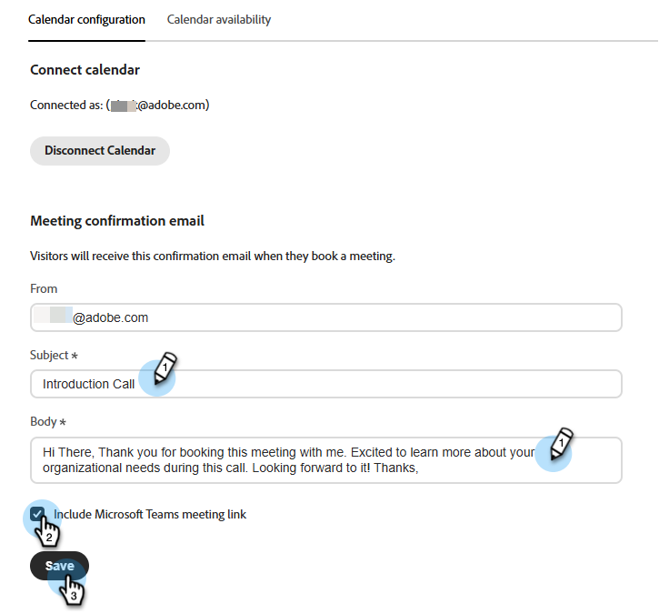
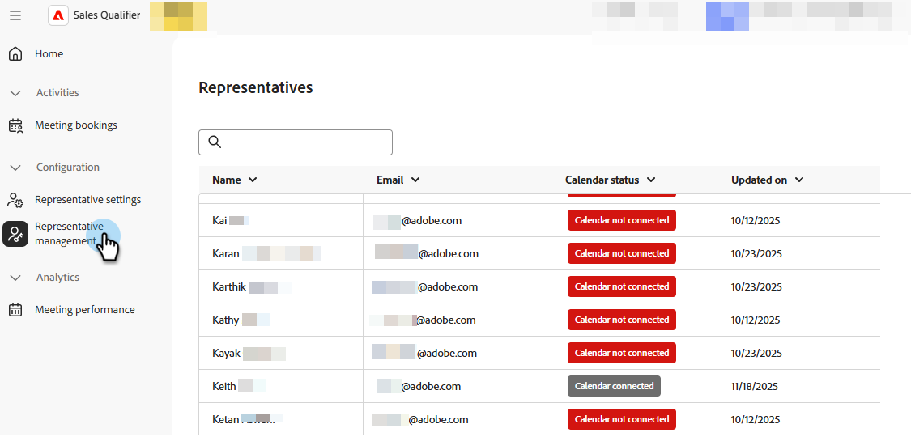
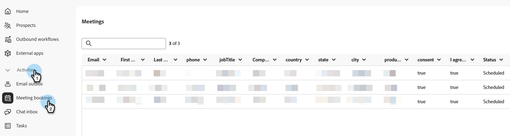
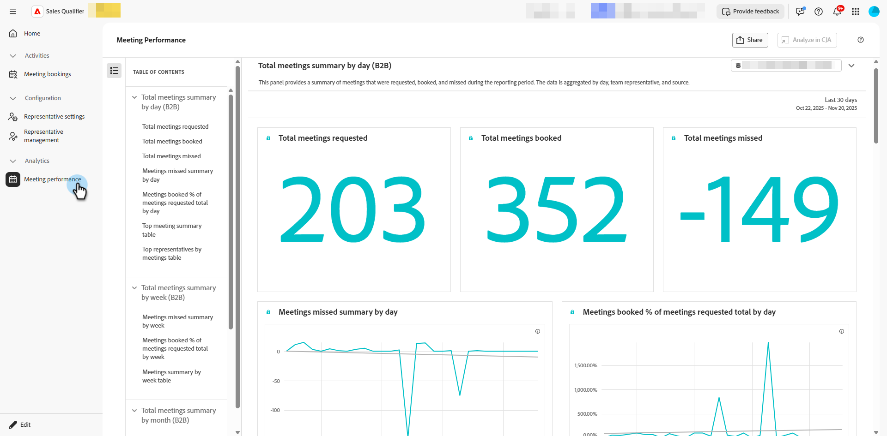

# Meetings {#meetings}

Get to know all of your _Meeting_ settings in Adobe Brand Concierge. Connect your calendar, set availability, view analytics, and more. 

Related: [Book a meeting](../getting-started/meeting-booking.md) video

## Configuration {#configuration}

Connect to your Outlook or Google account and determine various settings such as day of the week, time zone, and meeting duration.

### Connect your calendar {#connect}

1. Log in to [Adobe Experience Platform](https://experience.adobe.com/){target="_blank"}.

1. Select **[!UICONTROL Sales Qualifier]**.

   {width="800" zoomable="yes"}

1. Under _Configuration_, click **[!UICONTROL Representative settings]**.

   

   In the _[!UICONTROL Calendar configuration]_ tab, choose your desired calendar. In this example, you are selecting **[!UICONTROL Outlook]**.

1. Choose an already signed-in account, or add a new one.

   

1. After the connection is complete, specify your desired email content. 

   This is the content that is sent to the recipient when they book a meeting with you. You can also include a Microsoft Teams meeting link (optional). 

   

1. Click **[!UICONTROL Save]**.

### Set calendar availability {#availability}

1. Click the **[!UICONTROL Calendar availability]** tab.

   

1. Choose your desired settings. 

   In this example, you are choosing **[!UICONTROL Meeting Durations]** of 30 minutes with a 15-minute **[!UICONTROL Buffer Time]** and a **[!UICONTROL Minimum Notice]** of 2 hours. Availability is set to Monday through Friday, 8 a.m - 5 p.m. PST, with a one-hour break at noon.

   >[!NOTE]
   >
   >To add more time options, click the plus sign ().

   

1. Click **[!UICONTROL Save]**.

### Representative management {#representative}

**Admins only**. See which of your representatives have successfully connected their calendar.

   {width="800" zoomable="yes"}

## Activities {#activities}

Click **[!UICONTROL Meeting bookings]** to review meetings that have been booked, see what information has been captured, learn when the meeting was scheduled, and more.

### Meeting page {#bookings}

{width="800" zoomable="yes"}

## Analytics {#analytics}

Click **[!UICONTROL Meeting performance]** to review several different analytics categories, including how many visitors have requested meetings and how many have been missed. You can see what has been the trend of the meetings, who are the representatives who took the meetings, and so much more.

### Meetings page {#performance}

{width="800" zoomable="yes"}
